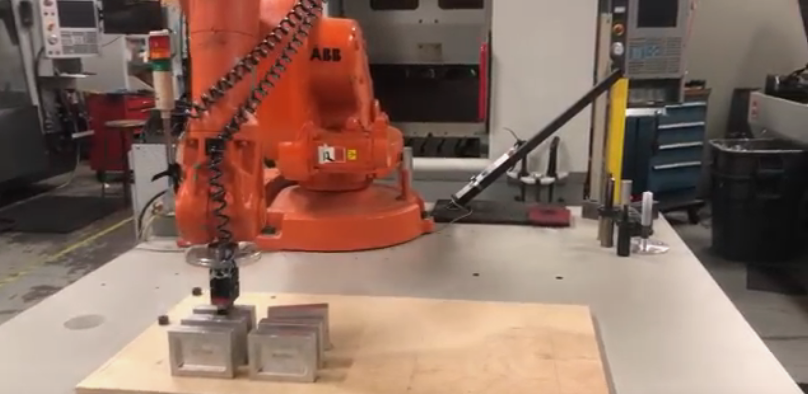
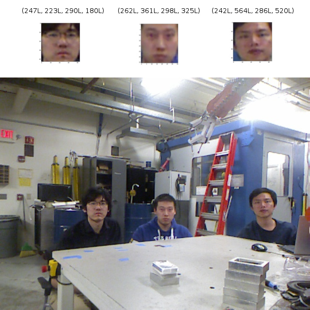
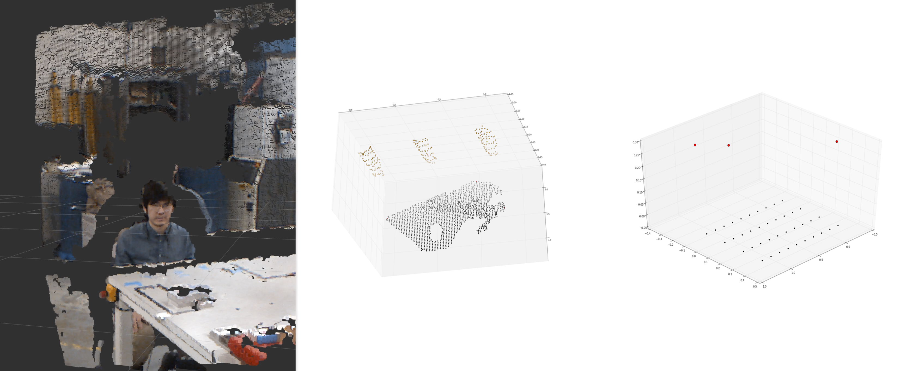
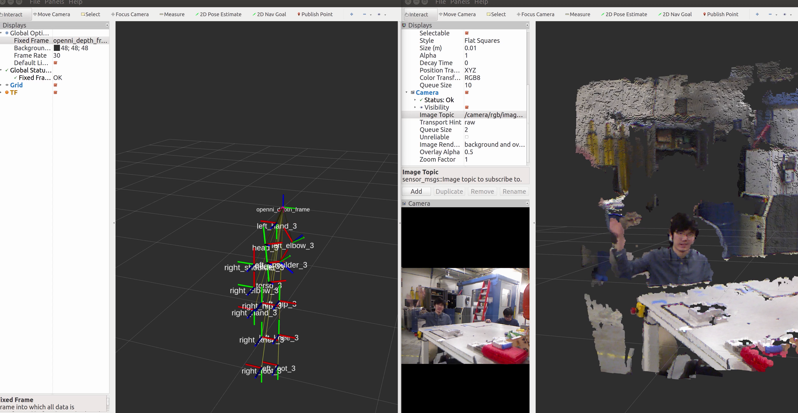
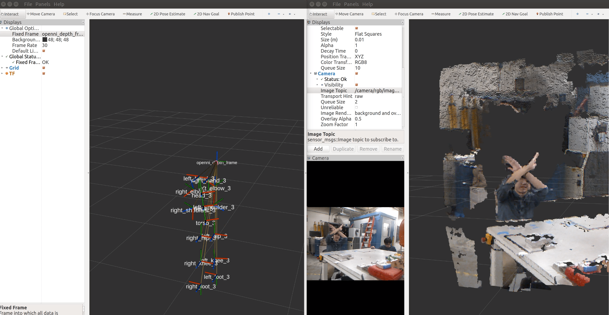
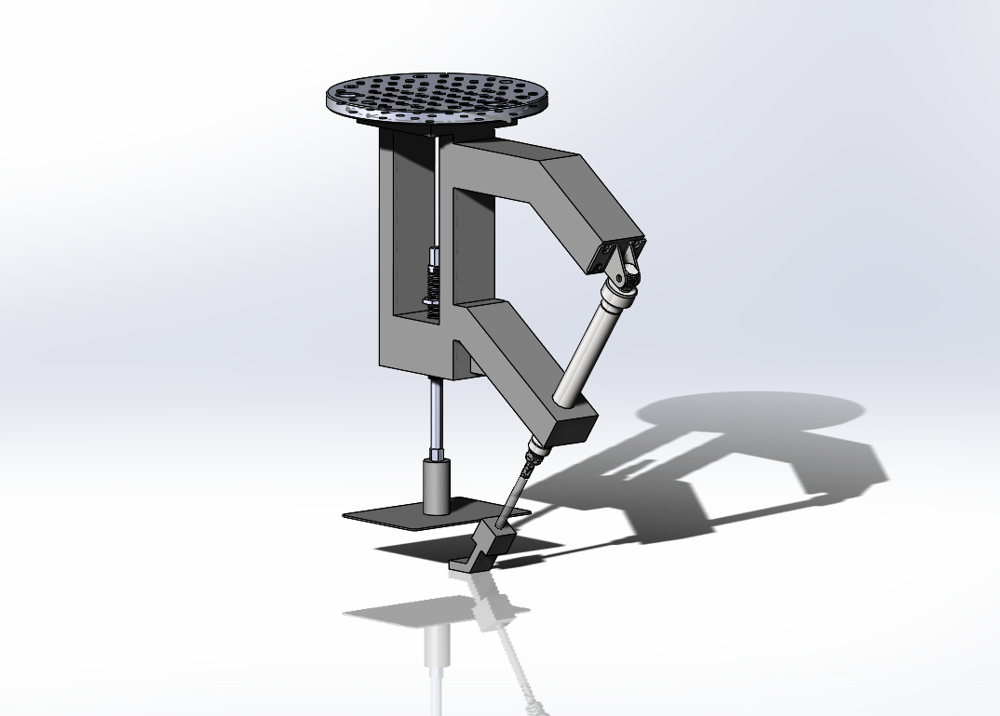

# Robotic Texas Hold'em Dealer

This project is to develop a card dealing robot arm for a Texas Hold'em game. The basic rule of the game can be viewed on [Wikipedia Texas Hold'em](https://en.wikipedia.org/wiki/Texas_hold_%27em).

#### Video Demonstration

  	

## Platform

Computer 1: Windows 10 + Robotstudio 2019.4

Computer 2: Ubuntu 16.04 + ROS kinetic

XBOX 360 Kinect 1.0

ABB IRB 1600 1.45m

## Dependencies

#### Installation

**Kinect API**

`sudo apt-get install ros-kinetic-openni-camera`

`sudo apt-get install ros-kinetic-openni-launch`

**NITE and openni_tracker**

As openni_tracker does not officially support ROS kinetic, a tutorial of how to install openni_tracker and its dependencies can be found on [OpenNI Kinect Installation](https://www.reddit.com/r/ROS/comments/6qejy0/openni_kinect_installation_on_kinetic_indigo/).

**[Facial Recognition Library](https://github.com/ageitgey/face_recognition)**

Install dlib and python libraries following [Installing dlib](https://gist.github.com/ageitgey/629d75c1baac34dfa5ca2a1928a7aeaf)

Install Face recognition by

`pip3 install face_recognition`

#### Build Instructions

- In the first computer, download the folder `RobotStudioStation`, then unpack and work in RobotStudio.

- In the second computer, clone this repository.

- Make a build directory: catkin_make

- Run by

  launch Kinect

  `roslaunch openni_launch openni.launch depth_registration:=true`

  open Kinect skeleton tracker and other nodes

  `roslaunch s_dealer dealer.launch`

  start rviz to visualize results 

  `rosrun rviz rviz`

## Procedure Detail

#### Facial Recognition 

This project uses [Facial Recognition Library](https://github.com/ageitgey/face_recognition). It is a convenient and powerful library using [dlib](http://dlib.net/)'s state-of-the-art face recognition built with deep learning. It receives an RGB image from the topic `/camera/rgb/image_color` published by the Kinect. Then a facial recognition is implemented which returns the players' location.

#### Player Area Detection

The location can be transformed as indices of the images. The area detection node could use the same indices to extract players' face coordinates from the point clouds provided by Kinect. Also, the area detection node performed a plane detection to find the location of the table. As long as the corners of the table are obtained, a homogeneous matrix transforming points from camera coordinate to table coordinate can be computed, and the players location in the camera coordinates can be transformed to that with respect to table coordinate. 

With the use of facial recognition and player area detection, we could know how many players are going to play and where to deal the players' cards.

#### Instruction Recognition

The next thing to do is to let the robot know when to deal and when to stop the game. The skeleton tracker node is used here to track the player's instruction during the game.  We define "raising right hand" as starting and continuing the game and define "doing cross above the hand" as stopping the game. The skeleton images are shown as follows.

#### Dealing

For the Texas Hold'em game, we not only need to deal the card facing down but facing up for the public cards as well. To complete this target, we designed and manufactured a end of tooling. The CAD image of the tooling is shown below. 

The suction cup part is used to suck the cards up. To deal the card facing down, one only needs to use the suction cup. To deal with the card facing down, however, the pneumatics actuator plays a role as its stretching arm stays in the way when the card falls down, which leads to the cards flipping upside down.

#### Motion Planning

Motion planning part is done in RobotStudio using player area detection data and instruction data.  At the beginning of the dealing, the robot acquire the location of the players and generate relevant trajectory. Before every dealing, the robot asks for instruction of the player to decide whether to continue or stop the game.

#### Communication

The two computer communicate using [socket](https://docs.python.org/2/howto/sockets.html) communication.